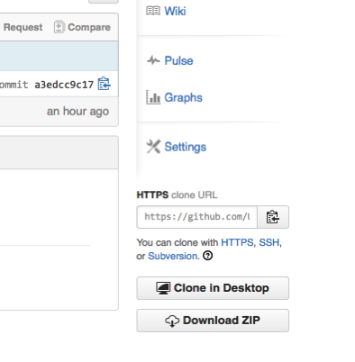

Uppgift 1501c
======
Programmering med handledningstid i labbsalen
_Ulrik Eklund, 2015-09-04_

Syfte med uppgiften:
------
Studenten ska använda moderna utvecklingshjälpmedel, som IDE (Integrated Development Environment), för programutveckling av inbyggda system.  
Studenten ska självständigt konstruera programvara för inbyggda system som läser och skriver till externa enheter.

Som vanligt så innehåller all mjukvara buggar, troligtvis även det exempelprojekt som labben utgår ifrån. Se det som en del av labben att eliminera eventuella existerande buggar om de påträffas!

**Den här uppgiften består att kombierna ihop flera olika filer till ett enda program, du måste titta igenom hur projektet är uppbyggt och förstå varifrån de olika funktionerna anropas för att klara av hela laborationen.**

Krav för godkänt:
------
Ha genomfört följande labbmoment enligt denna handledning:

1. Ladda ner labbens kodexempel från github (fork + clone)
2. Kompilera och ladda ner det existerande programmet till Due-kortet
3. Köra programmet och se testerna fallera
4. Implementerat funktioner för LCD-displayen så att testerna passeras:
    - Rensa LCD
    - Skriva ut fyra siffror på LCD
5. Implementera funktioner för A/D-omvandlaren så att testerna passeras:
    - Initialisera A/D-omvandlaren
    - Läsa värde från A/D-omvandlaren
6. Implementera funktioner för knappsatsen på LCD-shielden så testerna passeras:
    - Tolka värde från A/D-omvandlaren till en specifik knapp
7. Ta bort kommentarerna för någon av de oändliga looparna i main.c och se värdet på LCD:n ändras beroende på vilken knapp som trycks in
8. Checka in kod + tester till ett centralt GIT-repo (skapa en pull request)
Du visar upp för läraren för bedömning först när du är helt klar alla stegen.

Lämpliga förberedelser
------

Om annan dator än labsalens dator används (t.ex. egen dator) måste följande program finnas installerat på den datorn:

1. Atmel Studio 6.1 eller senare (finns endast för Windows). Man måste installera terminalfönstret separat i Atmel Gallery
2. Bossac.exe och tillhörande bat-fil, den senare har instruktioner för hur man konfigurerar Atmels Studio
3. Github client ellerTortoiseGit (för andra datorer än Windows finns andra Git-klienter)
4. Rekommenderas också att ha ett USB-minne för att lätt kunna flytta sitt lokala repo

Labben kommer att innehålla C-programmering för att komma åt olika typer av in- och utgångar och hur man skapar och testar lämpliga abstraktioner för dessa. Mer specifikt kommer du att behöva kunna, utöver vad som gick igenom till föregående laborationer:

- Hur man skapar större projekt med flera filer (sektion 5 i [1]).
	- Skillnaden mellan deklarationer och definitioner av funktioner och praxis i vilka filer man gör detta
	- Vad som är scope för en variabel beroende spå var den definieras. Vad `static`och `extern` betyder.

- Förstå hela byggprocessens för ett C-program i ett inbyggt system, från kompilering via länkning till flashning av microcontrollern.

- Känna till hur pinnarna på Arduino Due förhåller sig till utgångarna på SAM3X8E [4].

- Känna till vilka hårdvaruregister (sektion 36 i [3]) och bibliotek i [Atmel Software Framework](http://asf.atmel.com/docs/latest/search.html?board=Arduino%20Due/X) som används att styra timer counter (TC) på en SAM3X8E Cortex-M3 mikrocontroller. Den används för att implementera en enkel funktion `delayMicroseconds()` som väntar en specifik tid.

- Känna till vilka hårdvaruregister (sektion 31 i [3]) och bibliotek i [ASF](http://asf.atmel.com/docs/latest/search.html?board=Arduino%20Due/X) som används att styra digitala utgångar på en SAM3X8E Cortex-M3 mikrocontroller. Det finns en enkel funktion `lcdWrite()` som använder sig av dessa utgångar för att styra Hitachi HD44780U Dot Matrix Liquid Crystal Display Controller[5] för att driva displayen på Arduino-shielden. `lcdWrite()` skriver i sin enklaste användning en enstaka [ascii-symbol](http://www.asciitable.com) på displayen.

- Känna till vilka hårdvaruregister(sektion 43 i [3]) och bibliotek i [Atmel Software Framework](http://asf.atmel.com/docs/latest/search.html?board=Arduino%20Due/X) som används att läsa A/D-ingången på en SAM3X8E Cortex-M3 mikrocontroller. Här används den för att avkoda knapparna på LCD-shielden (se kretsschema i [6]).

- Tester för C-funktioner [8]

Det finns ett diagnostiskt test på It’s learning. Gör det innan du går till labbsalen som en koll på att du kan grunderna!

Läs igenom grunderna i versionshantering med git, t.ex. denna självstudiekurs: <http://try.github.io/levels/1/challenges/1>

Du skall också ha läst igenom hela denna handledning innan du går till labbsalen!

Själva uppgiften
------

Skapa ett personligt repo för denna programmeringsuppgift med hjälp av Git
För att fortsätta jobba och ändå ha kontroll på vem som gör vad så låter vi Git hålla reda på det för alla studenter och lärare i kursen, vilket är en av Gits styrkor (och varför det används i projekt med hundratals utvecklare, t.ex. open-source-projektet Linux).

Det finns ett centralt repo för kursen på github med webbadressen: 
<https://github.com/MalmoUniversity-DA264A/Task1501c> 

1. Skapa en lokal ”fork” av detta repository på kursuppgiftens webbsida (se <https://guides.github.com/activities/forking/>). Då kan du jobba vidare på ditt eget projekt i ett eget repository utan att oroa dig för att förstöra kursens gemensamma repot. Enklast är att skapa en fork från githubs webbgränssnitt till kursrepot


2. Ange att du skall forka repot till din egen användare på github (den har du redan skapat). I resten av handledningen kallas denna användare _StudentNN_.

3. Än så länge finns bara ditt nya repo på github-servern, men du vill ju kunna jobba med projektet lokalt på din dator. Därför måste du klona det nyligen skapade repot till din lokala dator, vilket betyder att du skapar en identisk kopia som hela tiden kan synkas med github med kommandona pull och push.  
Välj en katalog på datorn där du vill ha din lokala kopia av repot.  
Klona repot på github repo till din valda katalog på datorn med hjälp av github-bash.  Adressen du ska använda finns under HTTPS clone URL. Kommandoraden blir i Unix eller gitbash om man står i önskad katalog:
    
        >git clone https://github.com/StudentNN/Task1501c.git

där `StudentNN` är ditt användarnamn på github.



Under labben är det enklast om man jobbar mot ett och samma forkade repo i hela labben, även om det tillhör bara en specifik student. Om ni är två som vill jobba med varsitt lokalt repo kan ni ge båda studenterna rättigheter att jobba mot samma repo och sen klona repot på github till två olika datorer.


### Arbetskatalogen för denna uppgiften

I katalogen Task1501c finns denna handledning i `Instruction` och en projektmapp för Atmel studio vid namn `ProjectShield`.

### Använda Git

Med jämna mellanrum vill man committa sina ändringar till sitt lokala repo (Steg 3 i Figur 3). Git-shell-kommando:

    >git commit –am ”my latest work”

Varje commit bör vara en ”unit of functionality” som alltid kompilerar, t.ex. refaktorera namnet på en funktion, en ny feature, eller förbättrad dokumentation. Varje commit måste också ha en beskrivande kommentar så man vet vad det faktiskt var man ändrade.  
Git sparar alla tidigare commits, så man kan närsomhelst backa till ett tidigare commit-tillfälle om det skulle behövas.

Om en fil aldrig har blivit committad tidigare måste man ange att den ska adderas till Git-repot.

    >git add filnamn.xxx

eller
 
    >git add --all
    
Efter man gjort det första gången håller Git reda på att filen ”ingår” i repot (men den måste committas första gången ändå!). Git-klienterna burkar hålla reda på nyskapade filer i katalogerna som tillhör repot och frågar om de ska adderas.

### Bygga labbsetup

Utrustning:

- Utvecklingskort Arduino Due
- USB-kabel
- [LCD shield för Arduino](http://www.dfrobot.com/index.php?route=product/product&path=35_124&product_id=51#.Vcs3mosiYdI)

För att skydda AD-ingången från överspänning har ett extra motstånd lötts till som gör att [R2 är större än ursprungliga 2kΩ](http://www.dfrobot.com/image/data/DFR0009/LCDKeypad%20Shield%20V1.0%20SCH.pdf). **OBS! Om man använder en shield direkt från affären som inte modifierats riskerar man att bränna man Due-kortet!**

_Hur stort bör R2 vara om spänningen på AD0 skall högsta vara 3,3V när ingen knapp är intryckt?_

### Labbens programmeringsuppgift
Om du lyckats med att klona git-repot finns det nu i katalogen `Task1501c\ProjectShield` på din lokala dator en projektfil för Atmel Studio. Öppna den genom antingen genom att dubbelklicka eller genom ”open project” inifrån Atmel Studio.

Labben går ut på att ni ska skriva funktioner som passerar de testfall som finns definierade i projektet.  
Testa att kompilera projektet under menyn _Build_. Det här kollar främst att syntaxen är rätt, variabler är definierade och lite annat. C har annars få begräsningar vad som är rätt eller fel i språket.
Du bör inte få några varningar om du använder samma version på utvecklingsmiljön som projektet gjort hittills11. 

Ladda ner den färdiga binärfilen till Due-kortet via USB-kabeln med kommandot _BossacArduinoDue(Debug)_ under Tools-menyn. Finns inte det kommandot i menyn följ instruktionerna här, eller som kommentarer i bat-filen: <https://github.com/ctbenergy/BossacArduinoDue>  
Både bossac-programmet och bat-filen finns i katalogen i uppgiftens git-repo.
### Test-driven utveckling (Test-Driven Development TDD)
Wikipedia har en bra introduktion till tesdriven utveckling: <http://en.wikipedia.org/wiki/Test-driven_development>
Rent generellt ser processen ut som nedan.


I den här labben är några av stegen redan givna för alla testerna. I detalj så kommer ni att genomföra följande steg för varje test.

#### Förberedelse

1. Gör på en testlista (redan gjort för den här labben!). Testerna är
    - The delay timer is initialised properly
    - The delay timer counts properly
    - The LCD display is initialised
    - It is possible to write a single character to the LCD display  (actually writes 12 characters)
    - It is possible to erase all text on the LCD display
    - The A/D converter input is initialised properly
    - The A/D converter input reads a reasonable value when no button is pressed (should not be zero)
    - A function reads a value and interprets that no button is pushed (from a set of values in a struct)
    - A function displays a four digit int number on the LCD display 
    - A function displays a string on the LCD display 
    - A function displays what button is pressed on the LCD display

2. Skapa .c–filer och motsvarande .h-filer med funktionerna som skall testas, detta är redan gjort för modulerna som skall testas, de ligger i katalogen src.

#### Testcykeln

3. Välj ett test från testlistan (gör dem i samma ordning som de står i testrunner.filen `main.c`)
4. Skriv/uppdatera testfilen för funktionen som ska testas (redan gjort för alla tester)
5. Skriv/uppdatera en ”runner-fil” som exekverar valda tester (all testerna körs från början, men alla passerar inte)
6. Kompilera
7. Ladda ner det kompilerade programmet till Due-kortet
8. Kör programmet på Due-kortet
9. Se testen fallera, för det finns ju inget innehåll i den funktion som ska testas. För att resultatet ska synas måste terminalfönstret inuti Atmel Studio vara installerat.
10. Skriv programkoden så att funktionen klarar av testet (lägg till kod i respektive fil i src)
11. Kompilera och kör
12. Se testen/testerna passera, annars upprepa 8-9.
13. Städa och eventuellt kommentera din kod om det inte redan är gjort.

#### Samla ihop resultaten från TDD-cykeln

14. Commit till ditt personliga repo (valfritt)
15. Upprepa testcykeln tills alla tester i testlistan är implementerade. Då är även de två funktionerna färdigprogrammerade!

### Exempel på hur det ser ut för de tester som redan har implementerad kod: Delay-timern
Projektet har två kataloger som man jobbar mot, `src` och `test`. Funktionerna man utvecklar ligger i `src`. Testrunner-filen `main.c` och filerna med testerna ligger i katalogen `test`. Testramverket unity ligger i katalogen `unity`.  
Det finns redan funktioner för delay-timern i `delayFunctions.c` och `delayFunctions.h`, motsvarande tester för dessa funktioner finns i `test_delayFunctions.c` och `test_delayFunctions.h`, dessa tester exekverar redan från runner-filen.  
_Observera att man måste använda ASF Wizard under ASF menyn för att inkludera Atmels bibliotek för timern (TC) för att dessa ska fungera._

När man sen vill använda sina testade filer i produktionssystemet behöver man bara filerna i src-katalogen. Testfilerna används alltså bara under utveckling.

### En enkel testfil
Alla testfunktioner är av typen

```c
void test_TheFunctionsdoesSomethingUseful(void);
```

Dessa tester deklareras snyggast i en motsvarande h-fil för att inkluderas i runner-filen (se nedan).  
Ta för vana att döpa testfilen för att testa `Module.c` till `test_Module.c` 

I det här projektet finns det 3 filer med c-kod för tester, de innehåller totalt 9 tester, varav endast de som testar delay passeras.  
Testrunner-filen som kör testerna är projektets huvudfil, eftersom det är den här filen som allting körs ifrån måste den innehålla `main()`. Den måste också innehålla all nödvändig initiering av Due-kortet själv, många av de initialisationsfunktionerna kommer från Atmels ASF-bibliotek.

Det står kommenterat i `main()`var själva testramverket Unity börjar användas. Det är här det första testet körs.
När man lägger till fler tester görs det efter befintliga tester, men innan `UnityEnd();`  
Om man har flera källkodsfiler med tester har man en par av `UnityBegin()` / `UnityEnd()` för varje fil.

### Se resultatet från testerna

Eftersom det inte finns någon naturlig bildskärm kopplad till Due-kortet måste man få ut testresultaten på annat sätt.

I början på testrunner-filen finns hur man initierar att Due-kortet skriver på COM-porten på PC:n via USB-kabeln (`configure_console(void)`). Det gör det möjligt att använda terminalfönstret inifrån Atmel Studio som output för putchar() som Unity använder sig av. Men Terminalfönstret konkurrerar med Bossac om COM-porten så när man laddar ner sin binärfil till DUE-kortet måste terminalfönstret vara o-connectat (i Atmel Studio 6.2 görs detta automatiskt).  
Så fort man laddat ner sin binärfil till Due så startar ju programmet och därför missar man utskriften innan man gjort connect igen. Gör connect och tryck på reset-knappen för att starta testrunner-programmet om igen.

Om allt funkar som det ska ser du att Unity meddelar resultatet från testerna i terminalfönstret. Det går också att spara resultaten från terminalfönstret i en fil, vilket kommer att utnyttjas till inlämningen.

### Utveckling av funktioner för att använd LCD-display med Arduino

I filerna `LCDFunctions.c` och `lcdApplication.c` finns fyra funktioner redan definierade, men det saknas kod i de två sista av dem som du ska skriva för att testerna ska passeras. När funktionen funkar så kommer också testerna att passeras.

```c
int lcdInit(void);
int lcdWrite(uint8_t byte, bool type);
int lcdClearDisplay(void);
int lcdWrite4DigitNumber(int number);
```

#### int lcdInit(void)
Den här funktionen är en implementering i C av hur man initierar en LCD-display som styrs av Hitachi HD44780U (Dot Matrix Liquid Crystal Display Controller/Driver).  
Själva algoritmen beskrivs i Figur 24 på sidan 46 i databladet [5].

LCD-shielden som man sätter på Due-kortet har bara 4 datapinnar kopplade (se tillverkarens hemsida14), så efter att den omkonfigurerats till 4-bitas användning används `lcdWrite()` för att skicka data till displayen.

Tyvärr är inte pinnen som gör att man kan läsa status på LCD-shielden kopplad (pinne R/W), annars hade man använt den för att ge output till funktionen. Nu är funktionen implementerad på enklast möjliga sätt och ger ifrån sig 0 när den löpt igenom alla instruktionerna.

#### int lcdWrite(uint8_t byte, bool type);
Funktionen skriver en byte till LCD-displayen. Om `type == HIGH` tolkas det som att ett tecken ska skrivas, om `type == LOW` tolkas det som att ett kommande skickas till displayen15. Det som skrivs ut på displayen är ASCII-tecknet för det värde som byte innehåller (<http://www.asciitable.com>).  
Funktionen abstraherar bort två saker för programmeraren som använder den:

- Att LCD-shielden använder bara 4 pinnar i stället för 8.
- Att LCD-shielden, som är konstruerad för  Arduino Uno-kort, har pinnarna i omvänd ordning jämfört med Arduino Due.  

Funktionen gör att tecknen och kommandona till LCD-displayen kan programmeras rakt av enligt tabellerna 4 och 6 i referensmanualen till Hitachi-controllern.
Utvärdet från funktionen följer samma konvention som för Unix script, dvs 0 om allt går som det ska, i praktiken ger denna funktion alltid ifrån sig 0.
Programmering: Rensa LCD-displayen från alla tecken
Skriv en enkel funktion, `lcdClearDisplay(void)`, som rensar displayen och flyttar tillbaka markören till startpositionen. Funktionen kan t.ex. ge ifrån sig värdet 0 när den är klar (unix-standard för en funktion som inte ger några fel).  
Information hur det görs finns i tabell 6 i databladet till controllern för LCD-displayen [5]. Titta till exempel på de fem sista raderna i funktionen InitLCD() i projektet.

### Programmering: Skriva ut ett fyrsiffrigt tal på displayen

Skriv funktionen `lcdWrite4DigitNumber()` som tar ett fyrsiffrigt heltal som argument och skriver ut det som fyra på varandra följande bytes kodade i ASCII på displayen, t.ex. med hjälp av `lcdWrite()`. Testet för denna funktion kollar att den sista skrivna siffran är rätt, men du kan också se att värdet skrivs på displayen när testet körs (1357).
Funktionen bör ge ifrån sig värde 0 om den fungerar som det ska.  

### Programmering: A/D omvandlaren

Skriv funktioner för att initialisera A/D-omvandlaren i motsvarande c/h-filer. Använd Due pinne A0 som läser värdet för knappsatsen på LCD-shielden.  
Det första testet anropar funktionen `analogInit(0)` eftersom knappsatsen är kopplad till Due-pinne 0. Du ska skriva `analogInit()` och testet kollar att rätt statusbitar är satta i hårdvaran för den ingången som används efter att funktionen har körts.

Dokumentation och kodexempel för AD-omvandlaren finns på Atmels sida för ASF (<http://asf.atmel.com/docs/latest/sam3x/html/sam_adc_quickstart.html>, man behöver inte implementera några interrupts!)).

Efter initiering av A/D-omvandlaren krävs det få programrader för att läsa ett värde från A/D-omvandlaren, men du bör ändå skriva en funktion som kapslar in detta. Det andra testet kollar att värdet från A/D-omvandlaren är rimligt med tanke på att ingen knapp är intryckt (värdet varierar lite mellan olika LCD-shields eftersom motstånd inte är exakt lika stora). _Obs att att A/D-omvandlaren aldrig ger ifrån sig värdet 0 (eftersom ingången inte kan ha värdet 0 enligt kopplingsschemat för knappsatsen på LCD-shielden)._

Tänk på att man måste initialisera klockan för att A/D-omvandlaren ska snurra! Det finns en kodrad för det redan i projektet. A/D-omvandlaren har en egen klocka, precis som de flesta andra perifera enheter på processorns och de klockorna sätts inte på automatiskt om de inte behövs för att spara ström. Man kan till exempel titta på koden i `delayFunctions.c` där klockan för timer counter 0 initialiseras.

```c
void delay_init(void)	/*Initializes the timer used for delays */
{
           pmc_enable_periph_clk(ID_TC0);
           ...
}
```

A/D-omvandlarens klocka startas med precis samma funktion, men med ett annat ID-argument (ID_ADC).  
Det står i den Quick Start Guide för A/D-omvandlaren som finns på Atmels hemsida att det här måste göras under Prerequsites.

### Programmering: Sätta samman allt
Nu har du skrivit testade funktioner för att kunna visa på displayen och kunna läsa från knappsatsen på shielden, så nu kan du ta bort kommentarerna på följande rader i `test_lcdShield_runner.c`:

```c
//while(1)
//{
//	/* Infinite loop to display the current valued from the ADC reading the buttons */
//	lcdClearDisplay(void);
//	uint32_t tempValue = analogRead(0);
//	lcdWrite4DigitNumber(tempValue);
//	delayMicroseconds(500000);
//}
```

Då kommer värde för knappen som trycks in att skrivas ut på displayen och ändras när en annan knapp trycks in.

Som bonus-uppgift kan man nu lätt(?) skriva två funktioner som 

1. räknar ut vilken knapp som tryckts in `readLCDbutton()`
2. skriver ut på LCD-Displayen vilken knapp som har tryckts in (Select/Left/Right/Up/Down/None), `lcdWriteButtonValue()`. Lämpligtvis använder man den tidigare utvecklade funktionen `LCDWrite()`.

Nu har du klarat av all programmering som behövs (men det är lite kvar med själva inlämningen för att få godkänt). Visa gärna upp Due-kortet med LCD-displayen för handledaren om du befinner dig i labbsalen.  

### Lagra arbetet på github och lämna in för bedömning

Om du är klar med all programmering är det vara dags att synka ditt lokala repo med det som du har på github. Det görs med en push tillbaka till github (steg 3 i Figur 3).

    >git push origin
    
Din gitklient är oftast så smart att den kommer ihåg varifrån man klonade repot, därför kan man oftast använda origin istället för den långa webbaddressen. 

Har du kommit så långt har du ett uppdaterat repo som du kan se på githubs webbsida. Nu ska du skicka in en begäran att ägaren till det gemensamma kursrepot ska titta på dina ändringar genom en pull request (steg 5 i Figur 3). Där anger du en rubrik (till exempel att du är klar med en viss uppgift), och fyller i en beskrivning av vad dina ändringar består av.

**Glöm inte att ange namnen alla som bidragit med att göra klart uppgiften!** Det går inte att komma i efterhand och påstå att du varit med om ditt namn inte finns med på originalinlämningen! I så fall får du göra en egen pull request efteråt.

Ulrik kommer att titta på alla som har lämnat in till fredag samma vecka som uppgiften delades ut. Om du lämnar in senare kommer de att bedömas vid terminens slut i samband med tentamen.

Referenser
------
[1] Nick Parlante, Essential C, 2003, http://cslibrary.stanford.edu/101/

[2] C data types, https://en.wikipedia.org/wiki/C_data_types 

[3] Atmel SAM3X / SAM3A Series SMART ARM-based MCU DATASHEET, 2015, <http://www.atmel.com/devices/sam3x8e.aspx> 

[4] SAM3X-Arduino Pin Mapping, <http://www.arduino.cc/en/Hacking/PinMappingSAM3X> 

[5] Hitachi HD44780U Dot Matrix Liquid Crystal Display Controller/Driver reference manual, <https://en.wikipedia.org/wiki/Hitachi_HD44780_LCD_controller> and <https://www.sparkfun.com/datasheets/LCD/HD44780.pdf>

[6] DF Robot, LCD KeyPad Shield For Arduino product wiki, <http://www.dfrobot.com/wiki/index.php/LCD_KeyPad_Shield_For_Arduino_SKU:_DFR0009> 

[7] Dan Saks, Representing and Manipulating Hardware in Standard C and C++, Embedded Systems Conference San Francisco, 2002, <http://www.open-std.org/jtc1/sc22/wg21/docs/ESC_SF_02_465_paper.pdf> 

[8] Mark VanderVoord, Embedded Testing With Unity And Cmock - A Book For Those Who Code C And Want Awesome Well-Tested Products Using Free Tools And For Those Who Enjoy Short Books with Long Titles, 2010

Appendix: A/D channels versus Due pin mapping
------
Instance | Signal | I/O Line | Peripheral | Due Pin
---|---|---|---|---
ADC | ADTRG | PA11| B
ADC | AD0 | PA2 | X1| Analog In 7
ADC | AD1/WKUP1| PA3| X1| Analog In 6 
ADC | AD2| PA4| X1 | Analog In 5
ADC | AD3| PA6| X1| Analog In 4
ADC | AD4 | PA22 | X1| Analog In 3
ADC | AD5 | PA23 | X1 | Analog In 2
ADC | AD6 | PA24 | X1 | Analog In 1
ADC | AD7 | PA16 | X1 | Analog In 0
ADC | AD8 | PB12 | X1
ADC | AD9 | PB13 | X1
ADC | AD10 | PB17 | X1 | Analog In 8
ADC | AD11 | PB18 | X1 | Analog In 9
ADC | AD12 | PB19 | X1 | Analog In 10
ADC | AD13 | PB20 | X1 | Analog In 11
ADC | AD14/WKUP13 | PB21 | X1

Appendix: Output från sitt program
------
Eftersom det inte finns någon naturlig bildskärm kopplad till Due-kortet måste man få ut saker som vanligtvis skulle skrivas på en terminal på annat sätt.

I `ConsoleFunctions.c` finns ett exempel hur man initierar att Due-kortet skriver på COM-porten på PC:n via USB-kabeln (`configure_console(void)`). Det gör det möjligt att använda terminalfönstret inifrån Atmel Studio som output för `printf()`.  
Det finns dock ingen motsvarande h-fil, så den måste man skriva själv!

Man måste dessutom inkludera Atmels biblotek för seriell I/O med hjälp av ASF wizard i Atmel Studio. Parametrarna för terminalkommunikationen måste man ange i filen `config/conf_uart_serial.h* som genereras av ASF wizard när man inkluderar biblioteket. Enklast är att använda default-parametrarna genom att bara ta bort kommentarssymbolerna.

Terminalfönstret konkurrerar med Bossac om COM-porten så när man laddar ner sin binärfil till DUE-kortet måste terminalfönstret vara o-connectat.  
Så fort man laddat ner sin binärfil till Due så startar ju programmet och därför missar man utskriften innan man gjort connect igen. Gör connect och tryck på reset-knappen för att starta programmet om igen.

Appendix: Bossac-programmering
------
If you don't have administrative rights to modify Program Files on the Windows computer you can also do the following :

1. Copy the batch file and bossac.exe into the Solution folder of your Atmel Studio project 

2. Configure an 'External Tool' in Atmel Studio 6 (Tools -> External Tools...). 

   1 Configure a debug build command  
Titel: Arduino Due (Debug)  
Command: $(SolutionDir)\BossacArduinoDue.bat  
Arguments: "$(SolutionDir)\bossac.exe" "$(ProjectDir)\Debug\$(ProjectFileName).bin"  
Checkbox "Use Output Window". 

    2 Configure a release build command  
Titel: Arduino Due (Release)  
Command: $(SolutionDir)\BossacArduinoDue.bat  
Arguments: $(SolutionDir)\bossac.exe" "$(ProjectDir)\Release\$(ProjectFileName).bin"  
Checkbox "Use Output Window". 
 
3. Call 'External Tool' in Atmel Studio 6. 
_Tools -> BossacArduinoDue(Debug)_ for Debug Build or _BossacArduinoDue(Release)_ for Release Build


